# Praktikum Rekayasa Web

* **Nama:** Fahmi Hakim
* **NIM:** G.211.23.0019
* **Mata Kuliah:** Praktikum Rekayasa Web

---

## 📸 Dokumentasi Visual (Screenshots)

Berikut adalah detail tampilan aplikasi berdasarkan aset gambar yang tersedia:

### 🔐 Autentikasi & Landing Page
| Tampilan Sebelum Login | Halaman Login | Halaman Utama (Home) |
|:---:|:---:|:---:|
| 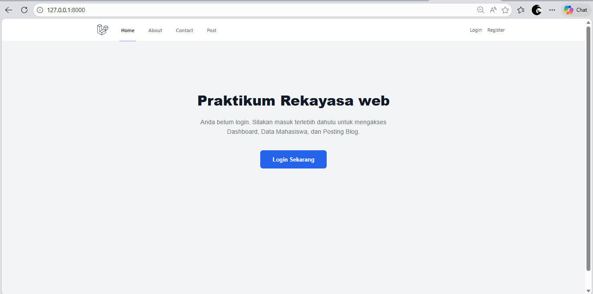 | 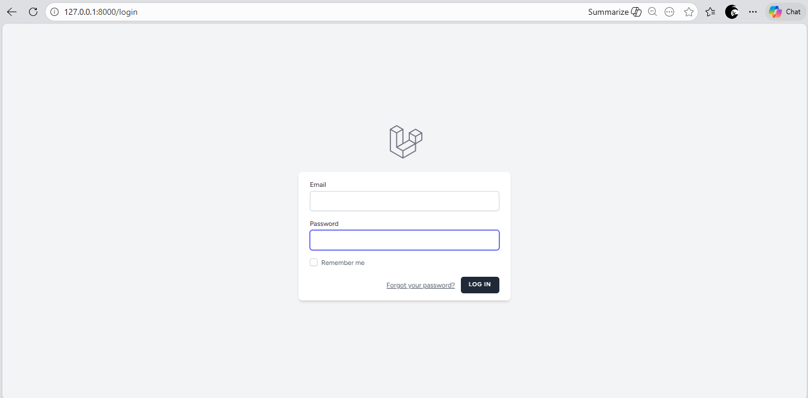 | 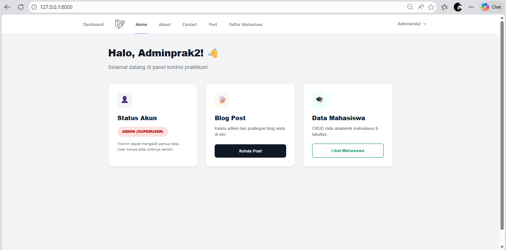 |

### 📊 Dashboard & Navigasi
| Dashboard Utama | Halaman About | Halaman Contact |
|:---:|:---:|:---:|
| 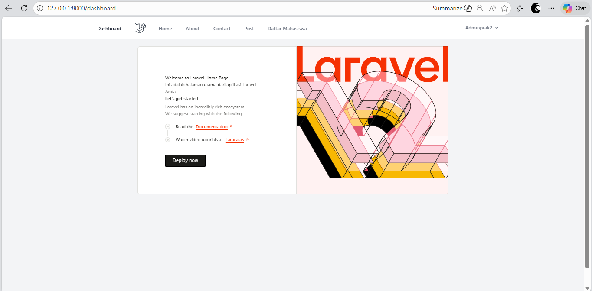 | 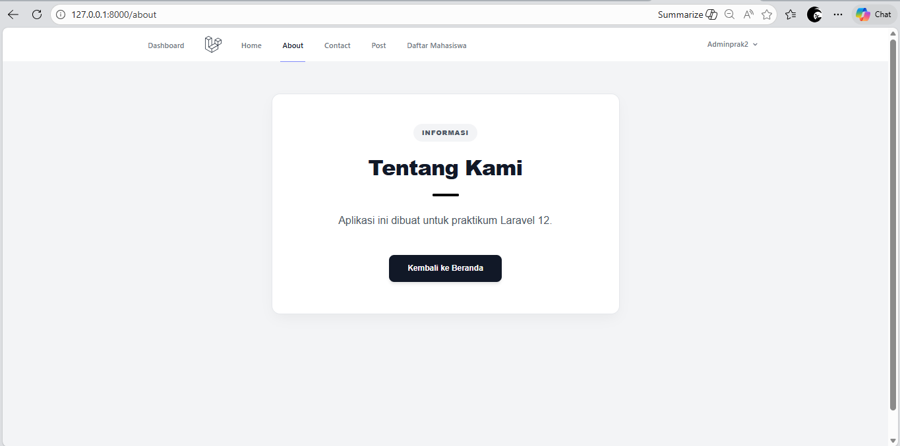 | 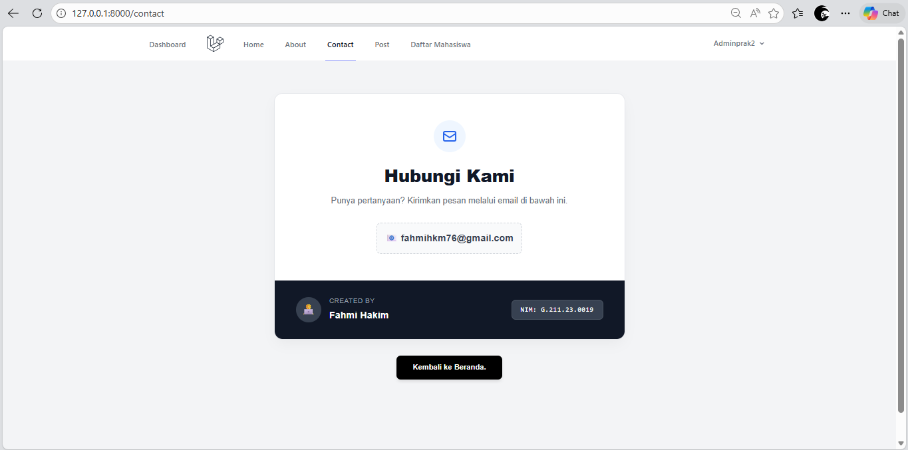 |

### 🎓 Manajemen Data Mahasiswa
| Daftar Mahasiswa | Tambah Mahasiswa | Detail Mahasiswa | Edit Mahasiswa |
|:---:|:---:|:---:|:---:|
| 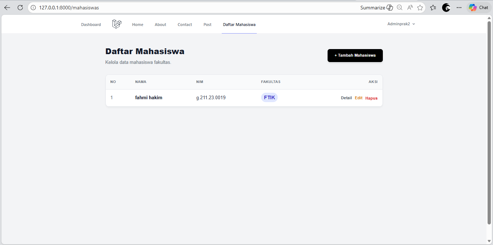 | 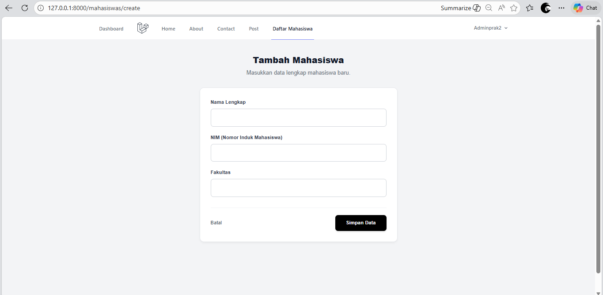 | 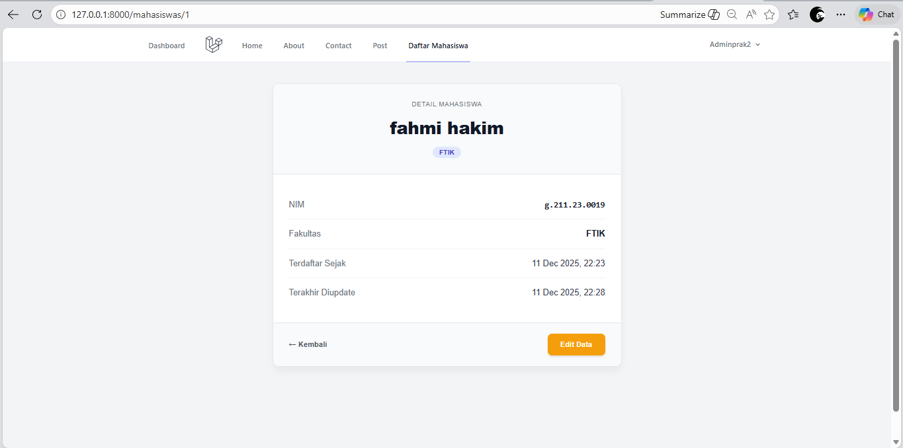 | 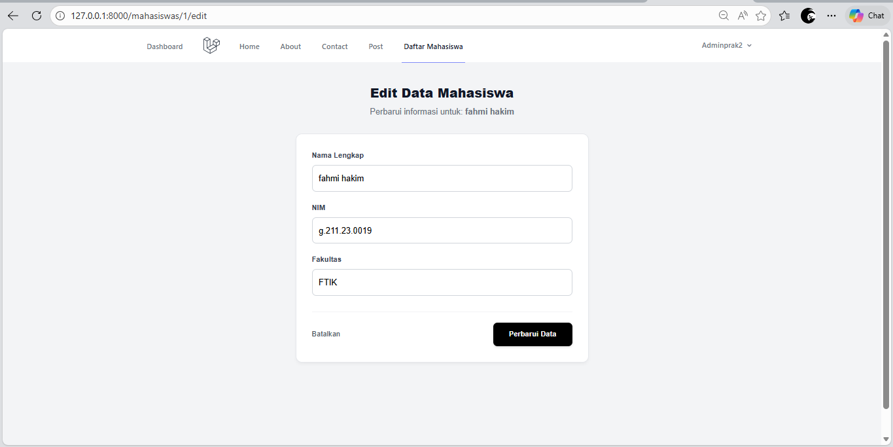 |

### 📝 Manajemen Blog Posts
| Daftar Posts | Tambah Post | Detail Post | Edit Post |
|:---:|:---:|:---:|:---:|
| 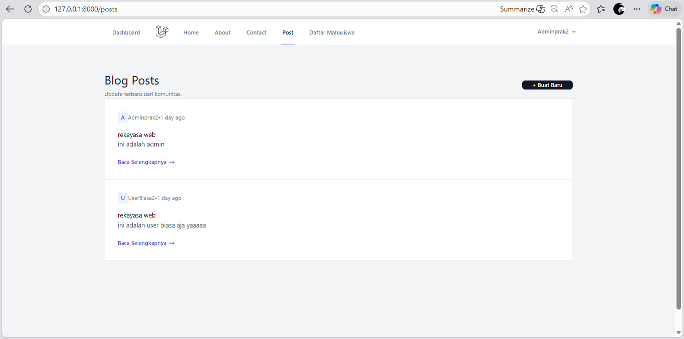 | 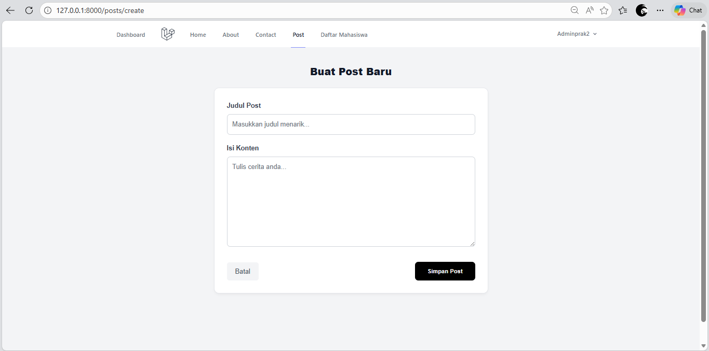 | 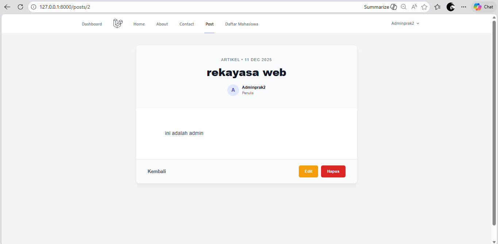 | 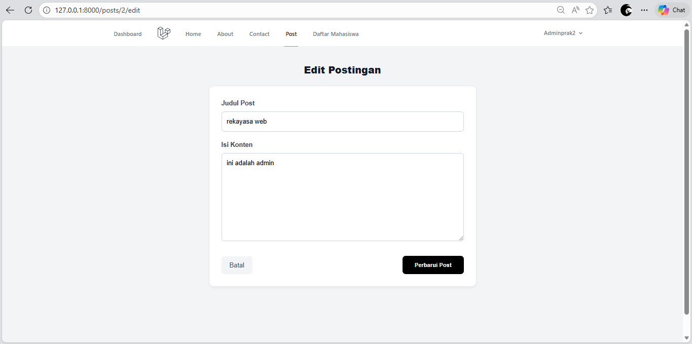 |

---

##  Fitur Utama
* **Autentikasi & Otorisasi:** Proteksi rute menggunakan Middleware Auth.
* **CRUD Mahasiswa:** Pengelolaan data mahasiswa lengkap dengan validasi NIM unik.
* **Blog System:** Fitur posting artikel untuk pengguna terdaftar.
* **Responsive UI:** Didesain menggunakan Tailwind CSS dan Blade Template Engine.
